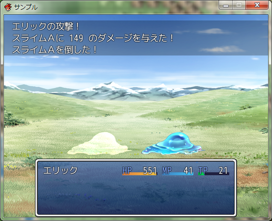
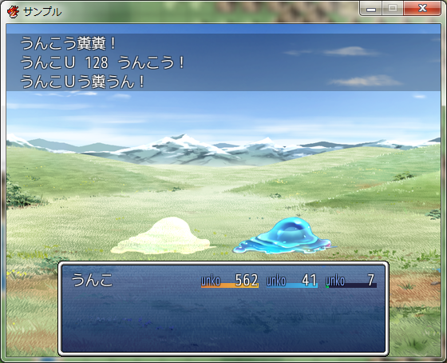

# BeUnko.RGSS3
ゲーム(RPGツクールVXAce製)をうんこにします。

## Usage
「RPGツクールVXAce」のスクリプトエディタにscript.rbの内容を貼り付けてください。貼りつける位置は「▼素材」の下です。

## Sample
### message
#### before

#### after

### status
#### before

#### after

### battle
#### before

#### after
