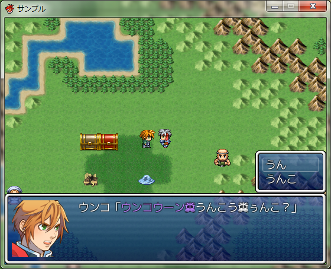

# BeUnko.RGSS3
ゲーム(RPGツクールVXAce製)をうんこにします。

## Usage
script.rbの内容をRPGツクールVXAceのスクリプトエディタの「▼素材」の下の( ここに追加 )あたりに挿入し貼りつけてください。

## Sample
### message
#### before

#### after

### status
#### before

#### after
